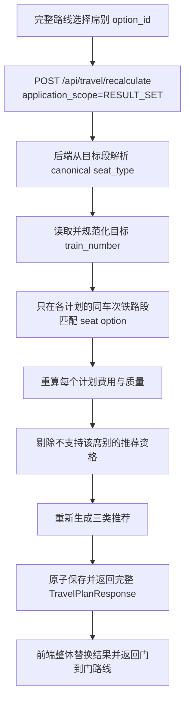
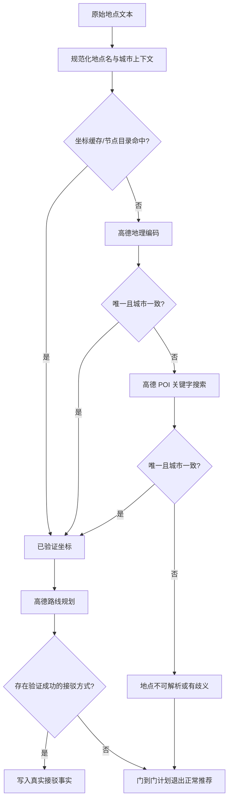
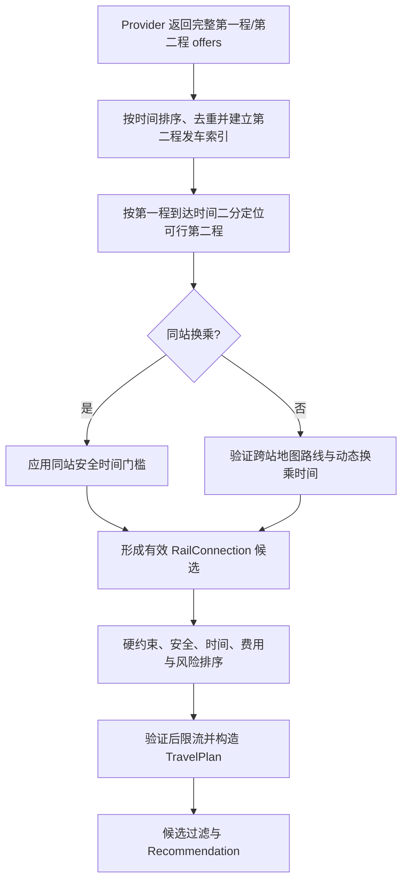

# Architecture

更新日期：2026-07-14

本文记录当前代码中已确认的架构；尚未落地的内容会明确标注为“目标设计，待实现”。

## 前端架构

- 当前前端是 `frontend/` 下的 Expo / React Native App。
- `frontend/index.ts` 使用 `registerRootComponent(App)` 注册 `frontend/src/App.tsx`。
- `frontend/src/App.tsx` 是当前主要 UI 与交互聚合点，包含输入页、结果页、推荐卡、方案详情、数据来源页、异步任务轮询、重算、跳转、反馈和本地留存交互。
- 当前未发现独立路由库；App 内使用底部 tab 状态在“云起”输入与“路明”结果之间切换。
- 当前未发现独立全局状态管理库；运行时状态主要使用 React `useState`、`useEffect`、`useMemo`、`useRef`。
- `frontend/src/api/client.ts` 统一封装 HTTP 请求与错误解析。
- `frontend/src/types/index.ts` 保存前端类型定义。
- `frontend/src/nativeCapabilities.ts` 封装定位授权、外部 URL、分享、复制、最近规划、收藏、提醒和偏好等本地能力。
- `frontend/src/designSystem.ts` 提供颜色、间距、圆角、触控热区和内容宽度等设计常量。

## 后端架构

- 当前后端是 `backend/` 下的 FastAPI 应用。
- `backend/app/main.py` 创建 FastAPI `app`，注册 lifespan、CORS、HTTP middleware、异常处理和全部 API 路由。
- 当前未发现独立 router/controller 注册文件；路由直接写在 `backend/app/main.py`。
- `backend/app/models/schemas.py` 是后端 Pydantic 合同模型中心。
- `backend/app/services/` 是业务服务层：
  - `intent_parser.py`：自然语言输入解析与 TravelRequest 语义校验。
  - `planner.py`：主规划编排、方案构建、失败记录、结果聚合与重算。
  - `candidate_generator.py`：候选方案筛选与排序。
  - `recommendation.py`：LLM 推荐结果校验与三张推荐卡生成。
  - `location_resolver.py`：地点、城市、站点、机场候选解析。
  - `local_transfer_engine.py`：本地接驳段与接驳方式构建。
  - `cost_comfort_risk_engine.py`：费用、舒适度、风险和数据质量计算。
  - `store.py`、`persistence.py`、`cache_store.py`：运行时索引、持久化和 TTL 缓存。
  - `observability.py`：指标快照和事件聚合。
  - `task_queue.py`：异步任务、Provider 超时和并发配置读取。
- `backend/app/data_sources/` 是外部数据源适配层：
  - 配置加载：`config_loader.py`。
  - 地图路线：`map_providers.py`。
  - 地理编码：`geocoding_providers.py`。
  - 铁路：`rail_providers.py`。
  - 航班：`flight_providers.py`。
  - 天气：`weather_providers.py`。
  - LLM：`llm_providers.py`。
  - 跳转：`redirect_providers.py`。
  - 交通目录导入解析：`transport_catalog_providers.py`。
- `backend/app/core/` 提供请求上下文、安全校验和日志配置。

## LLM Prompt 架构边界

- Prompt 设计文档只作为架构约束，不作为运行时 LLM input。
- 运行时 LLM input 由两部分组成：
  - `backend/app/llm/prompts/*.txt` 中对应调用的 system prompt。
  - `backend/app/data_sources/llm_providers.py` 按当前请求拼接的 user prompt。
- Intent Parser Prompt 只解析用户自然语言中的出发地、目的地、日期、时间、偏好、交通方式限制、预算和乘客备注；不得生成车次、航班、票价、余票、候选站点、候选机场、路线方案或推荐方案。
- Recommendation Prompt 只从后端提供的候选摘要中选择 CHEAPEST、MOST_COMFORTABLE、BALANCED 三个 slot；不得生成、补全或修改任何候选方案事实字段。
- Schema 名称如 `TravelRequest Schema V1.16`、`LLMRecommendationOutput Schema V1.16` 只代表后端校验契约。Prompt 中必须提供模型生成 JSON 所需的最小字段契约和关键枚举，不应假设 LLM 天然理解项目内部 Schema。
- Recommendation user prompt 必须单独列出合法 `plan_id` 清单，并要求 AVAILABLE.plan_id 逐字复制该清单中的真实 ID；Prompt 模板不得包含可被模型照抄为真实 `plan_id` 的占位符。
- 完整 `TravelPlan`、完整 JSON Schema、API key、第三方 token、内部成本、实名乘客信息和支付信息不得发送给 LLM。

## 前后端数据流

1. 用户在 App 输入自然语言出行需求。
2. 前端通过 `planTripAsync` 调用 `POST /api/travel/plan/async`。
3. 后端解析输入为 `TravelRequest`，创建 `AsyncJob`，立即返回 RUNNING 状态和 `polling_url`。
4. 前端根据 `async_job.polling_url` 轮询 `GET /api/travel/jobs/{job_id}`。
5. 后端后台任务调用规划链路，返回 `TravelPlanResponse`，其中包含候选方案、推荐结果、数据源元信息、失败说明和用户可见警告。
6. 前端展示推荐卡、候选方案、方案详情、数据状态和数据来源。
7. 用户调整席别、舱位或接驳方式时，前端调用 `POST /api/travel/recalculate`。
8. 用户跳转购票/导航时，前端调用 `POST /api/redirect/booking` 获取 redirect-only URL 或说明。
9. 用户反馈和行为事件分别通过 `POST /api/feedback`、`POST /api/events` 上报。

## 用户流程

- 输入：自然语言描述出发地、目的地、日期、时间约束和偏好。
- 规划中：前端显示异步规划状态，可轮询、重试或取消任务。
- 结果：展示三类推荐卡、候选方案、数据状态、缺失能力和阻断说明。
- 详情：展示时间线、费用、风险、接驳、席别/舱位、来源和可信解释。
- 调整：支持按出发/到达时间重算，支持局部选项重算。
- 跳转：仅生成外部官方或地图跳转，不在本系统内登录、下单、支付或抢票。
- 留存：本地保存最近规划、收藏、提醒和偏好；事件上报不应包含账号、支付、实名或凭证信息。

## 模块职责

- App UI：`frontend/src/App.tsx`。
- API 调用：`frontend/src/api/client.ts`。
- 前端本地能力：`frontend/src/nativeCapabilities.ts`。
- 前端展示格式化：`frontend/src/utils/format.ts`。
- 后端 API 注册：`backend/app/main.py`。
- API 合同：`backend/app/models/schemas.py`、`schemas/*.schema.json`、`frontend/src/types/index.ts`。
- 规划编排：`backend/app/services/planner.py`。
- 数据源适配：`backend/app/data_sources/*_providers.py`。
- 数据源配置：`backend/app/data_sources/config_loader.py` 和 `backend/app/data_sources/data_sources.*.json`。
- 请求上下文、安全与日志：`backend/app/core/`。
- 测试：`backend/app/tests/`。
- 工具脚本：`scripts/`。

## 错误处理策略

- `backend/app/main.py` 使用统一异常处理返回 `ErrorResponse`。
- 请求校验错误返回 `VALIDATION_ERROR` 和 422。
- HTTPException 会被包装为 `HTTP_{status_code}`。
- 未捕获异常返回 `INTERNAL_ERROR` 和用户可见的通用提示。
- HTTP middleware 为响应写入 `x-request-id`、`x-trace-id`、`x-correlation-id`、`x-device-id`。
- 安全策略失败由 `evaluate_request_security` 拦截，并以统一错误结构返回。
- 规划链路使用 `SourceFailure`、`missing_components`、`blocked_plan_types` 和 `missing_plan_explanations` 表达数据源失败或能力缺口。
- 前端 API client 在非 2xx 时读取 `ErrorResponse.user_visible_message` 或 `message` 并抛出 Error。

## 约束无匹配与最近备选架构（V1.16，已实现）

### 已解决的问题

- 约束判断已收敛到 `backend/app/services/constraints/`，规划器与候选生成器统一消费结构化评估结果。
- 真实候选全部违反可放宽硬约束时返回 `planning_status=NO_MATCH`，不再混入系统失败。
- 响应保留最近安全备选、分类型偏差和数据源覆盖范围，可解释“最早几点到”“最低需要多少预算”。
- 分钟、金额、交通方式、换乘和安全要求不可直接换算为一个稳定的通用分数。

### 状态语义

- `COMPLETE`：查询正常完成，存在满足全部硬约束的方案。
- `PARTIAL`：存在满足硬约束的方案，但部分方案族或数据源不可用。
- `NO_MATCH`：查询正常完成，存在可靠候选，但没有候选满足全部硬约束；可返回需用户确认的最近备选。
- `FAILED`：系统异常、核心数据完全不可用，或无法形成任何可验证结论。
- 异步任务计算出 `NO_MATCH` 时，`AsyncJob.job_status` 使用 `COMPLETE`，表示任务正常结束；不得记为任务失败。

### 约束分级

1. 不可放宽约束：安全、合规、无障碍刚需、绝对换乘安全下限、核心事实未验证、`RiskLevel.BLOCKED`。违反后直接排除，不得作为备选。
2. 用户确认后可放宽的硬约束：最晚到达、最早出发、时间窗、预算、允许/排除交通方式、直达要求、换乘次数、指定席位或舱位。违反后只能进入最近备选池。
3. 软偏好：价格、舒适度、少换乘、少步行等。软偏好只影响排序，不应默认排除方案；若用户表达“必须/不能”，Intent Parser 应将其提升为硬约束。

### 分类型约束计算器

统一计算器接口，保留不同偏差单位：

- 时间：分钟及 `EARLIER` / `LATER` 方向。
- 预算：同币种、同 scale 的 `amount_minor` 差值；无法可靠换汇时不得比较。
- 交通方式：新增、缺少或命中排除项的集合，不转换为数值分数。
- 换乘：超出次数；换乘安全先过绝对门禁，再比较缓冲分钟。
- 席位/舱位：请求值与可用替代值，不与时间或金额直接换算。
- 余票、步行和总耗时：分别使用票数、米数和分钟。

每个计算器输出结构化 `ConstraintEvaluation`，至少包含 `constraint_type`、`satisfied`、`relaxation_policy`、`requested_value`、`actual_value`、`deviation`、`reason_code` 和用户可见说明。LLM 不参与硬约束判定、偏差计算或放宽决策。

### 决策流程

1. 规划器生成具有 Provider 核心事实的原始候选。
2. 数据可信度门禁剔除核心事实不完整的候选。
3. 安全/合规门禁剔除不可放宽候选。
4. 约束评估器为每个候选生成分类型偏差向量。
5. 满足全部硬约束的候选进入正常 `plans` 和推荐链路。
6. 正常候选为空时，对可放宽候选执行 Pareto 筛选：若 A 在所有可比偏差上不劣于 B，且至少一项更优，则删除 B。
7. 从 Pareto 前沿按赛道选择最多 3 个代表：`CLOSEST_TO_TIME`、`CLOSEST_TO_BUDGET`、`LEAST_BEHAVIOR_CHANGE`。同一赛道内使用字典序规则，不计算跨单位总分。
8. 返回 `planning_status=NO_MATCH`、`plans=[]`、`recommendation_result=null` 和 `constraint_analysis`。
9. 前端展示“约束未满足”状态；备选必须标记“不满足原始要求”，不得进入正常三张推荐卡、直接购票或 LLM 推荐池。
10. 用户明确接受某个放宽建议后，前端以调整后的 `TravelRequest` 重新调用规划接口；只有新请求满足约束的方案才能进入正常结果。

### 赛道内排序

采用确定性字典序：

1. 不可放宽约束违反数必须为 0。
2. 被放宽的显式硬约束种类越少越好。
3. 优先保留用户明确表达的高优先级约束。
4. 比较当前赛道的同类型偏差。
5. 数据质量越高越好。
6. 风险越低越好。
7. 最后比较软偏好。

跨类型方案不选“总冠军”。例如“晚到 10 分钟且不超预算”和“按时但超预算 20 元”应作为两个取舍并列展示，除非用户已经明确时间或预算优先级。

### 数据覆盖与结论边界

- Provider 查询成功且返回空结果时可以说“未找到”。
- Provider 超时或失败时只能说“暂时无法确认”。
- Provider 未启用时必须说明“该交通方式未覆盖”。
- 只有相关交通方式均为 `VERIFIED` 时才能声称“全交通方式最早/最低”；否则只能说“当前已验证铁路方案中最早”等受限结论。

### 目标模块边界

约束规则从 `planner.py` 和 `candidate_generator.py` 收敛到 `backend/app/services/constraints/`：

- `models.py`：内部评估模型。
- `evaluator.py`：统一执行计算器。
- `time_calculator.py`、`budget_calculator.py`、`transport_mode_calculator.py`、`seat_cabin_calculator.py`：分类型偏差计算。
- `safety_gate.py`：不可放宽门禁。
- `pareto.py`：Pareto 支配筛选。
- `relaxation_selector.py`：分赛道选择最近备选。

`planner.py` 只负责编排，`candidate_generator.py` 只消费已满足硬约束的候选。第一期不引入数据库迁移；`constraint_analysis` 随 `TravelPlanResponse` 使用现有持久化 JSON 保存。

### 影响范围

- 后端：Schema、规划编排、候选过滤、异步任务状态映射、持久化索引和可观测性。
- 前端：类型定义、轮询完成判断、`NO_MATCH` 页面、备选详情、确认放宽后重新规划。
- API：`TravelPlanResponse` 已增加 `constraint_analysis`，`PlanningStatus` 已增加 `NO_MATCH`，schema version 为 `1.16`。
- 可观测性：新增 `PLANNING_NO_MATCH` 业务事件，不能混入系统失败或普通规划成功指标。
- 测试：分类型计算器、安全门禁、Pareto、覆盖范围文案、同步/异步接口和前端空态。

### 风险与回滚

- 风险：把软偏好误当硬约束、把未覆盖 Provider 误报为无方案、备选进入正常推荐池、Pareto 前沿过大、前后端对新枚举处理不一致。
- 控制：计算器使用确定性规则；备选上限为 3；合同测试校验 `NO_MATCH` 不含正常推荐；日志记录过滤前后数量、违反原因和 coverage，不记录敏感信息。
- 回滚：保留现有 `FAILED + missing_plan_explanations` 路径作为功能开关关闭后的行为；关闭约束分析功能时不生成 `constraint_analysis`，不影响正常 `COMPLETE/PARTIAL` 方案链路。

## 后续扩展方式

- 新 API：优先在 `backend/app/models/schemas.py` 定义请求/响应模型，再在 `backend/app/main.py` 注册路由，并同步前端 `frontend/src/api/client.ts` 与 `frontend/src/types/index.ts`。
- 新数据源：新增或扩展 `backend/app/data_sources/*_providers.py`，在 `data_sources.*.json` 和 `.env.example` 增加配置，并补充 Provider 测试。
- 新规划能力：优先接入 `planner.py` 编排，必要时拆分到 `services/` 独立模块，并补充 schema、测试和数据源失败语义。
- 前端拆分：当前 `App.tsx` 较集中；后续可按“输入、规划状态、结果概览、方案详情、数据来源、反馈”等边界抽出组件，但需要同步更新本索引。
- 合同变更：运行 `scripts/export_schemas.py`，检查 `schemas/` diff，并同步前端类型。

## 地图路线降级与同车次席别同步架构（V1.17，已实现）

### 当前问题与根因

#### 地图 Provider 状态被过度放大

- 2026-07-12 本地真实 smoke 已确认高德路线、Nominatim、地图跳转均可用；额外对打车、地铁、公交、步行进行的上海样例查询也均成功。因此“地图路线 Provider 不可用”不能解释为地图服务整体宕机。
- `local_transfer_engine.py` 会为一个接驳段分别查询打车、地铁、公交、步行。任一需记录的选项缺坐标或查询失败，`_record_rule_fallback()` 都会立刻写入全局 `missing_components += map_route` 和全局警告。
- `planner.py` 只要发现 `map_route` 缺失就把整次结果标为 `PARTIAL`；前端 `ResultsOverview` 又优先展示第一条全局 warning/source failure，导致“某个未选接驳备选失败”被表达成“当前地图 Provider 不可用”。
- 首选 Provider 失败、备用 Provider 成功时，现有文案仍强调“首选不可用”，没有先表达“当前路线已有可用结果”。这属于降级成功，不应与无可用路线混为一类。
- `OsrmRouteProvider` 当前固定调用 driving profile，却会接收地铁、公交和步行请求。OSRM 只能作为其真实支持方式的备用来源，不能以 driving 结果冒充公共交通或步行结果。

#### 席别调整只修改单个计划快照

- 完整路线页调用 `/api/travel/recalculate` 时虽默认发送 `PLAN_AND_RECOMMENDATION`，后端仍只 `deepcopy(existing)` 并修改目标 `plan_id`。
- 推荐重算只把已修改计划放回原计划列表；其他计划的铁路段、费用和舒适度均保持原值。
- `RecalculateResponse` 只返回一个 `plan`；前端 `replacePlan()` 也只按 `plan_id` 替换一条计划。因此返回门到门路线后，其他推荐卡仍显示旧席别，这是当前合同和状态模型的必然结果，不是单一页面刷新问题。
- 用户选择的是“席别语义”（如二等座/一等座），不是可跨车次复用的 `option_id`。不同车次的同一席别可能具有不同 option_id 和价格，不能把目标段的 option_id 复制到其他方案。

### 推荐方案

#### 1. 分离 Provider 健康、精确查询结果和展示影响

地图状态分三层处理：

1. Provider 配置/健康：由 `/api/data-sources/status` 与独立 smoke 表达，回答“服务是否已启用、当前是否健康”。
2. 精确路线查询：每个接驳选项记录 `PRIMARY_VERIFIED`、`FALLBACK_VERIFIED`、`RULE_ESTIMATED` 或 `UNAVAILABLE`，回答“本次起终点 + 交通方式是否取得路线”。
3. 计划影响：只有当前计划实际选中的接驳选项为规则估算或不可用时，才允许把 `map_route` 放入全局 `missing_components` 并影响 `planning_status`；未选备选失败只保留在数据来源详情，不污染结果页主警告。

具体规则：

- 首选成功：不产生失败警告。
- 首选失败、能力匹配的备用 Provider 成功：保留可观测性记录，但主文案为“当前路线已由备用地图数据源提供”；不写“地图 Provider 不可用”，也不把可用路线记为缺失。
- 所有能力匹配 Provider 均失败、规则估算成功：仅受影响的选项标记 `RULE_ESTIMATED`；若它是当前选中项，结果可为 `PARTIAL`，文案限定为“该接驳路线暂未取得地图结果，已使用规则估算”。
- 坐标缺失：使用 `MAP_COORDINATES_MISSING`，不得归因成 Provider 宕机。
- Provider 超时、限流、空结果、未启用分别保留独立 error code，不再统一映射为 `MAP_ROUTE_UNAVAILABLE`。
- 地图适配器声明支持的 `TransportMode`；调度器只把请求交给能力匹配的 Provider。OSRM driving 只可覆盖驾车/打车类路线，除非未来接入并验证对应 profile。

#### 2. 将席别选择同步到结果集中的同一车次

为重算增加与计算范围正交的应用范围：

- `TARGET_PLAN`：保留现有局部调整，适用于接驳方式等仅针对当前方案的操作。
- `RESULT_SET`：把席别选择同步到当前 `TravelPlanResponse` 中所有包含目标车次的计划，并重新生成推荐结果。完整路线页的铁路席别调整使用该范围，但不得影响其他车次。

结果集席别重算流程：

1. 后端根据目标铁路段的 `option_id` 查出权威 `seat_type`，不得信任前端传入的展示 label 作为事实。
2. 从目标铁路段读取并规范化 `train_number`，以该车次作为本次同步键；车次为空时拒绝结果集同步，不使用站点或文案猜测身份。
3. 遍历同一结果集的所有 `TravelPlan`，只选取 `train_number` 与目标段一致的 `RailSegment`；按规范化后的 `seat_type` 查找各段自己的合法 option_id。
4. 对每个命中目标车次且成功应用的计划重新计算票价、总费用、舒适度、数据质量和相关展示摘要；不复用目标计划的 option_id 或价格。
5. 不包含目标车次的计划和同一计划中的其他车次保持原席别、费用与推荐资格。本操作不得写入全局 `travel_request.preferred_rail_seat`，避免把车次级选择误当成全行程硬约束。
6. 某计划包含目标车次但该段没有该席别时，才进入 `unsupported_plan_ids` 并退出本轮推荐候选池；其他车次缺少该席别不构成不支持。
7. 对更新后的完整计划集重新执行候选门禁和 Recommendation；不同车次可以继续使用各自原席别参与推荐。
8. 后端原子更新结果集快照、plan 索引和 plan-to-response 索引，再返回完整更新后的结果集。后续再次重算、详情读取和跳转必须看到同一版本。
9. 前端用返回的完整结果集替换 `response`，而不是只替换单个 plan；尽量保留当前 plan_id，若它不再具备推荐资格则选择新的首个可用推荐方案。

### 数据流

### 影响范围与文件修改范围

- API/schema：`backend/app/models/schemas.py`、`schemas/*.schema.json`、`frontend/src/types/index.ts`。
- 后端重算与推荐：`backend/app/services/planner.py`、`candidate_generator.py`、`store.py`、`persistence.py`，必要时抽出结果集偏好应用器。
- 地图能力与错误聚合：`backend/app/data_sources/map_providers.py`、`backend/app/services/local_transfer_engine.py`、`planner.py`、Provider 配置与 smoke 脚本。
- 前端：`frontend/src/api/client.ts`、`App.tsx`、`RouteDetailScreen.tsx`、`ResultsOverview.tsx` 和数据来源展示。
- 测试：地图 Provider 能力路由、失败分级、选中/未选选项影响、结果集席别传播、推荐重排、持久化一致性和前端整体替换。

### 风险与控制

- 结果集批量更新可能出现部分计划成功、部分失败：先在内存构造完整新快照并验证，再一次性更新索引；不得边遍历边持久化。
- 同车次在不同计划中的 option_id 或价格可能不同：逐段匹配合法 option 并独立重算；只复用车次与席别语义。
- 同一车次因区间或快照差异可能缺少目标席别：只将受影响的同车次计划标为 unsupported，不扩大到其他车次。
- LLM 只能在已完成席别应用和资格过滤后的候选中选卡，不能修改席别、价格或 option_id。
- 地图主警告收敛后可能降低问题可见性：详细 source failure 和结构化日志继续保留，只有结果页主状态按实际选中路线聚合。

### 回滚方式

- 席别结果集传播使用功能开关；关闭后回到 `TARGET_PLAN` 旧行为，但前端必须同步隐藏“应用到全部方案”的承诺。
- 新增合同字段保持可空/有默认值，回滚服务时旧客户端仍可使用单计划 `plan` 字段。
- 地图错误聚合可回滚展示策略，不回滚 Provider 原始失败日志；禁止通过重新启用不匹配的 OSRM mode 来掩盖问题。

## 当前边界

- 当前没有独立 Web 前端交付路线。
- 当前没有独立后端 routers/controllers 分层。
- 当前没有前端路由库或全局状态库。
- 当前接口文档只记录代码中已发现的接口。

## 高德地点解析与无规则估算接驳架构（已实现）

实现日期：2026-07-13；代码提交：`7603cf3`。

### 当前问题

- 当前已启用 `amap_route`，但它只负责“已知起终点坐标后的路线计算”，不能代替地名搜索。
- `resolve_location()` 可以在本地目录未命中时调用地理编码 Provider，但接驳链路使用的 `resolve_location_point()` 只查本地地点常量和交通节点目录，未调用任何在线地理编码。
- 因此“温州永嘉桥头梨村”“武汉新天地”等高德可搜索地点，在接驳链路中仍会直接得到空坐标。
- 当前 `local_transfer_engine.py` 在坐标或路线缺失时构造 `RULE_ESTIMATED`，填入规则生成的距离、耗时和费用。这些值不是地图事实，不应参与门到门总时间、总费用或推荐排序。
- 相同接驳段会按多个计划和多个交通方式重复记录坐标缺失，放大前端警告。

### 推荐方案

接驳地点与路线必须采用以下事实链路：

1. 对规范化后的地点名查询本地坐标缓存和已授权交通节点目录。
2. 未命中时调用高德地理编码；地址结果不足以唯一确定时，调用高德 POI 关键字搜索并使用出发/目的城市作 `city` 限定。
3. 对候选执行城市一致性、坐标完整性和唯一性校验；不能唯一确定时返回结构化歧义，不猜测选择。
4. 坐标解析成功后，按 Provider capability 调用高德路线规划；经批准的其他地图 Provider 只可作为真实路线备用来源。
5. 只把 Provider 返回且通过校验的距离、耗时、费用和路径写入 `LocalTransferOption`。
6. 不再生成 `RULE_ESTIMATED`，不再用固定分钟数、固定距离或固定费用补齐接驳事实。
7. 某种接驳方式失败时，从该段可选项中移除；至少一种方式验证成功时，计划可继续使用验证成功的选项。
8. 一个必需的首程或末程接驳没有任何已验证方式时，该门到门计划退出正常候选和推荐，并通过 `SourceFailure`、`missing_plan_explanations` 表达原因；不得用干线车次拼成看似完整的门到门计划。

### 数据流

### 缓存、去重与限流

- 坐标缓存键至少包含规范化地点、城市和 Provider；路线缓存键包含坐标、交通方式和 Provider。
- 同一规划任务先解析唯一地点集合，再复用坐标；禁止按“计划 × 接驳方式”重复搜索同一地点。
- 相同 `地点对 + error_code` 的失败在一次响应中聚合，前端只显示一条主警告，详细尝试保留在结构化日志。
- 高德 QPS、超时和重试由 Provider 适配层统一控制；不得通过恢复规则估算规避限流。

### 影响范围与文件修改范围

- Provider 与配置：`backend/app/data_sources/geocoding_providers.py`、`config_loader.py`、`data_sources.*.json`、`.env.example`。
- 坐标解析与缓存：`backend/app/services/location_resolver.py`、`cache_store.py`。
- 接驳与计划过滤：`backend/app/services/local_transfer_engine.py`、`planner.py`、`candidate_generator.py`。
- 合同与展示：`backend/app/models/schemas.py`、`frontend/src/types/index.ts`、结果页与数据来源组件；V1.17 中 `RULE_ESTIMATED` 仅保留为兼容值，服务端新结果不得再产生。
- 测试与 smoke：地理编码、接驳、地图 Provider、规划集成和真实 API smoke。

### 风险与回滚

- 高德搜索可能返回多个同名 POI：必须按城市和完整地址消歧；无法唯一确定时提示用户补充地址，不取第一条。
- 地理编码或路线 Provider 超时会减少可推荐方案，但比生成不可验证的接驳事实更安全。
- 规则估算关闭后，现有依赖估算接驳才能成形的样例可能从 `PARTIAL` 变为无完整门到门候选，测试数据必须改用可搜索真实地点或显式 mock Provider。
- 使用功能开关可回滚高德搜索调度顺序，但不得重新启用规则估算；紧急回滚时只能把接驳标为不可用并退出推荐。

## 铁路中转完整候选匹配架构（V1.17，已实现）

设计日期：2026-07-14。实现日期：2026-07-14，代码提交：`bdff0d67300a04676da2ba3ac45131575850d4fb`。

### 当前问题与证据

- `rail_providers.py` 已按发车时间升序返回完整铁路 offer，但 `planner.py` 在验证连接前只取第一程前 2 个和第二程前 2 个，最多检查 4 个组合。
- 2026-07-15 岳阳至张家口真实查询中，岳阳至北京西的 G502 于 14:12 到达，北京西至张家口的 D6649 于 14:58 发车，46 分钟换乘满足当前 45 分钟安全门槛；由于 D6649 不在第二程最早两个 offer 中，现有规划器没有检查该组合。
- 同次复现中，北京西完整 offer 集存在大量满足时间门槛的组合，因此该失败属于候选提前截断造成的假阴性，不是 12306 无车或无票价。
- 当前中转计划在两段铁路之间无条件调用 `taxi(first_offer.destination_station, second_offer.origin_station, ...)`。北京西至北京西属于同站换乘，不应依赖地图路线；否则修复时间匹配后仍可能被零距离地图查询错误淘汰。
- 当前失败聚合会把某个中转站的缺票价错误放大为整个 `TRANSFER_RAIL` 的 Provider 核心事实失败，无法区分“Provider 没有事实”和“事实存在但没有安全连接”。

### 推荐方案

#### 1. 连接匹配独立成内部服务

新增 `backend/app/services/rail_connection_matcher.py`，负责纯内存、确定性的两段铁路连接匹配；`planner.py` 只负责查询 Provider、调用 matcher、构造门到门计划和聚合结果。

内部策略至少包含：

- `min_same_station_transfer_minutes`：同站最低换乘时间，第一期默认 45 分钟。
- `max_transfer_wait_minutes`：允许的最大等待时间，第一期默认 360 分钟。
- `allow_overnight_transfer`：第一期固定为 false，隔夜中转另行设计。
- `max_connections_per_first_offer` 与 `max_raw_connections_per_hub`：只在连接验证后限制内存候选数量，不得用于截断 Provider 原始事实。

#### 2. 按到达时间查找可行第二程

1. 第一、二程 offer 分别按时间排序并去重。
2. 为第二程构建发车时间数组。
3. 对每个第一程计算 `earliest_second_departure = first.arrival_at + required_transfer_minutes`。
4. 使用二分查找定位第一班可行第二程，继续扫描到最大等待时间边界。
5. 对连接执行车站身份、时间、票价、席别、重复车次和数据来源校验。
6. 完整有效连接生成后，再按硬约束、安全、到达时间、总耗时、等待时间、费用和风险排序并限制最终计划数。

该算法不增加 12306 请求次数，复杂度由无界笛卡尔积收敛为排序加区间扫描；禁止通过把 `[:2]` 改成 `[:10]` 作为最终修复。

#### 3. 区分同站换乘与跨站换乘

- 使用规范化后的 `station_id/station_code` 判断是否同站，不以展示名称模糊猜测。
- 同站换乘不调用地图 Provider，不生成出租车接驳；换乘等待由两段铁路的真实到发时间计算，并计入计划总时长与风险说明。
- 跨站换乘必须取得真实地图路线，所需换乘时间为出站缓冲、验证后的地面接驳时间和进站缓冲之和；路线不可验证时连接不得进入正常计划。
- 第一阶段不新增 API segment 类型；前端可继续消费相邻两个 `RailSegment`。若后续需要单独展示站内等待，再通过新 schema version 增加专用连接段，不与本次紧急修复绑定。

#### 4. 正确表达无连接原因

- Provider 返回空、缺票价、超时、限流继续使用对应 Provider 错误码。
- 两段 Provider 事实均有效但没有满足安全门槛的连接，使用 `RAIL_CONNECTION_NOT_FOUND`，不得伪装为 `RAIL_PROVIDER_MISSING_PRICE`。
- 日志至少记录 `first_offer_count`、`second_offer_count`、`pairs_examined`、`rejected_departed_before_arrival`、`rejected_transfer_buffer`、`rejected_max_wait`、`rejected_cross_station_route`、`valid_connection_count` 和 `selected_connection_count`。
- 日志不得记录完整用户输入、凭证或 API key；车次与站点只用于任务级诊断。

### 数据流

### 影响范围与文件修改范围

- 新增：`backend/app/services/rail_connection_matcher.py`。
- 修改：`backend/app/services/planner.py`、必要的铁路连接内部模型与 `.env.example` 配置。
- 测试：`backend/app/tests/test_rail_connection_matcher.py`、`backend/app/tests/test_planning_rules.py`、`backend/app/tests/test_rail_providers.py`，并由现有 API 全量回归覆盖外部响应。
- 文档：`docs/ARCHITECTURE.md`、`docs/Dev/task_from_arc_for_dev_20260714.md`、`docs/Test/task_from_arc_for_test_20260714.md`。
- 第一阶段不修改 API Contract、schema version、数据库结构和前端类型；无需数据库迁移。

### 风险与控制

- 候选数量增长：使用二分查找、最大等待窗口、每首段/每中转站验证后上限和任务级查询缓存控制，不在事实进入前截断。
- 过短换乘被推荐：45 分钟先作为可配置安全下限；跨站换乘必须使用更严格的动态门槛。
- 过长等待污染推荐：使用最大等待时间和总耗时排序；隔夜连接第一阶段明确排除。
- 同名站误判同站：只信任规范化 station id/code；无法确认时按跨站处理并要求验证。
- 状态语义回归：增加独立连接失败原因，合同外部结构保持 V1.17 不变。

### 回滚方式

- 使用 `TRAVEL_RAIL_CONNECTION_MATCHER_V2` 功能开关控制新 matcher；紧急回滚时恢复旧匹配路径。
- 新模块只改变候选生成，不迁移数据库、不改变已持久化响应结构，可独立回滚。
- 回滚后必须保留新增诊断日志，禁止通过伪造车次、规则估算或放宽安全门槛掩盖无连接问题。
